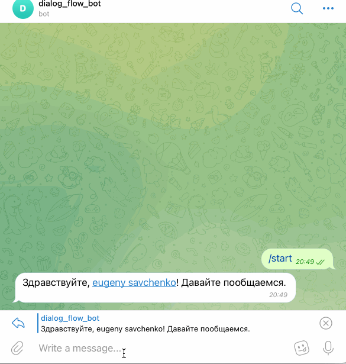

## Google "Dialogflow" and telegram bot and vk bot

Project to integration google api dialogflow in telegram bot and vk bot
via `python-telegram-bot` and `vk-api` modules.

## Getting Started

- Via `python-telegram-bot` and `vk-api` modules created simple echo bot on [telegram](https://web.telegram.org/#/login) messenger, and [vkontakte](https://vk.com/)
social network.
- Create Group in VK and use vk api to get secret key [vk API](https://vk.com/dev/bots_docs).
- Fulfill all necessary conditions on [google cloud](https://cloud.google.com/dialogflow/docs/quick/api) and create [dialogflow agent](https://cloud.google.com/dialogflow/docs/quick/api).
- Get all necessary api key and fill `.env` file.
```python
TELEGRAM_TOKEN="your telegram bot token"
DIALOG_FLOW_PROJECT_ID="your google cloud project identification"
GOOGLE_APPLICATION_CREDENTIALS ="your credentials JSON file"
VK_KEY="vk api secret key"
```

## Running

Running from command line:
```shell script
python tg_bot.py 
```
to start telegram bot.



```shell script
python vk_bot.py 
```

to start vkontakte bot.

#### Training dialog flow agent to new phrases in code

Dialog flow agent training by json file. Specify the path to the file.

to start in telegram bot write command:
```shell script
/train <URL to json file with training phrases>
```
Example content of training phrases, json file:

```{
    "Устройство на работу": {
        "questions": [
            "Как устроиться к вам на работу?",
            "Как устроиться к вам?",
            "Как работать у вас?",
            "Хочу работать у вас",
            "Возможно-ли устроиться к вам?",
            "Можно-ли мне поработать у вас?",
            "Хочу работать редактором у вас"
        ],
        "answer": "Если вы хотите устроиться к нам, напишите на почту game-of-verbs@gmail.com мини-эссе о себе и прикрепите ваше портфолио."
    },  ...
```

## License

You may copy, distribute and modify the software.